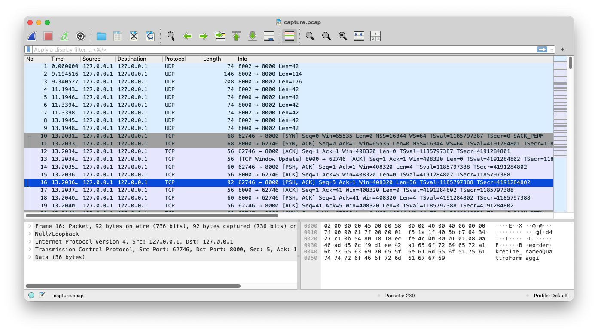

# Capturer des échanges TCP et UDP entre deux adresses locales

Ce document explique **comment capturer des dumps réseau** (TCP et UDP) à l’aide de **tcpdump**, ou **tshark** (wireshark).

Les exemples sont valables sur **Linux, macOS et Windows** (via WSL ou Npcap).

---

## 0. Pré-requis généraux

### Droits

La capture réseau nécessite des privilèges élevés :

```bash
sudo ...
```

Sur macOS et Windows, l’installation de **Npcap** peut être requise.

### Identifier l’interface réseau

```bash
ip addr        # Linux
ifconfig       # macOS
```

Interfaces courantes :

* `lo` / `lo0` : loopback (127.0.0.1)
* `eth0`, `en0`, `wlan0` : interfaces réseau

---

## 1. Capturer avec tcpdump (bas niveau)

### Capture TCP

```bash
sudo tcpdump -i lo tcp and host 127.0.0.1 and port 8000
```

### Capture TCP + UDP

```bash
sudo tcpdump -i lo '(tcp or udp) and host 127.0.0.1'
```

### Afficher les payloads en hexadécimal

```bash
sudo tcpdump -i lo tcp port 8000 -X
```

Options utiles :

* `-X` : hex + ASCII
* `-xx` : hex brut

### Sauvegarder dans un fichier PCAP

```bash
sudo tcpdump -i lo tcp port 8000 -w capture.pcap
```

Le fichier peut être analysé ultérieurement avec, par exemple, 

```bash
tcpdump -r capture.pcap
```

---

## 2. Capturer avec tshark (structuré, scriptable)

[`tshark`](https://tshark.dev/setup/install/) est la version CLI de Wireshark.

* Linux: `$PkgManager install wireshark`
* Macos: `brew install --cask wireshark`
* Windows: `choco install wireshark`

### Capture TCP

```bash
sudo tshark -i lo -f "tcp port 8000"
```

### Capture TCP + UDP

```bash
sudo tshark -i lo -f "(tcp or udp) and host 127.0.0.1"
```

### Afficher uniquement les champs utiles

```bash
sudo tshark -i lo -Y tcp -T fields \
  -e frame.number \
  -e ip.src \
  -e ip.dst \
  -e tcp.srcport \
  -e tcp.dstport \
  -e data
```

### Sauvegarde PCAP

```bash
sudo tshark -i lo -f "tcp port 8000" -w capture.pcap
```

### Export JSON (utile pour scripts)

```bash
sudo tshark -r capture.pcap -T json > capture.json
```

### Exporter une frame en hexadécimal

(le numéro de frame est 42 dans cet exemple; il est visible dans la première colonne de `tshark -r`)

```bash
tshark -r capture.pcap \
-Y "frame.number == 42" \
-T fields \
-e data
```

### Visualiser les frames avec Wireshark



---

## 3. Bonnes pratiques pédagogiques

* Toujours **capturer les frames brutes** avant d’analyser
* Travailler d’abord sans décodage automatique
* Annoter les octets significatifs
* Valider les hypothèses par expérimentation

---

## 4. Exemple de workflow recommandé

```text
1. tcpdump → capture.pcap
2. tshark → structure et champs
3. code Rust → parsing & validation
```

---

## 5. Rappel légal

Ne capturez **que vos propres communications** ou celles pour lesquelles vous avez une autorisation explicite.
