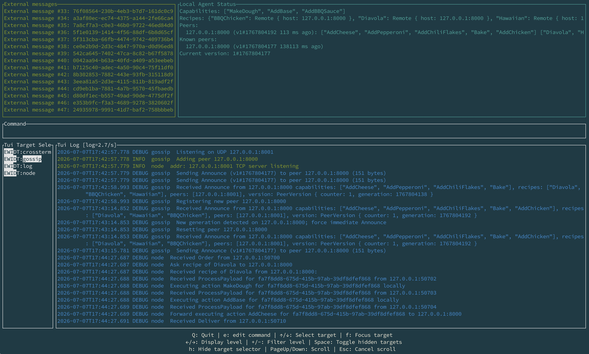

# Guide d'utilisation du binaire `pizza_factory` 📦

Le binaire `pizza_factory` (fourni dans le projet) est l'outil principal pour lancer des agents et interagir avec le réseau. Ce document décrit les modes d'utilisation essentiels pour vos tests et votre reverse-engineering.

## 🚀 1. Mode `start` : Lancer un agent

Le mode `start` permet de lancer un agent qui écoute sur le réseau.

### Utilisation de base
```bash
# Lance un agent sur le port par défaut (8000) sans capacités particulières
./pizza_factory start
```

### Options courantes
* `--host <HOST:PORT>` : Définit l'adresse et le port d'écoute (par défaut `127.0.0.1:8000`).
* `--capabilities <ACTION1,ACTION2>` : Liste les actions que cet agent sait effectuer.
* `--peer <HOST:PORT>` : Adresse d'un autre agent pour rejoindre un réseau existant (bootstrap).
* `--recipes-file <FILE>` : Charge un fichier contenant des définitions de recettes (DSL).
* `--gossip-rate <0.0-1.0>` : Règle la probabilité de propagation à des noeuds inconnus (0.0 = désactivé). Voir [GOSSIP.md](GOSSIP.md) pour les détails du protocole.
* `--debug` : Active les logs détaillés pour voir ce qui se passe sur le réseau.

### Exemple : Lancer une mini-chaîne de 2 nœuds
```bash
# Terminal 1 : Agent sachant pétrir la pâte
./pizza_factory start --host 127.0.0.1:8001 --capabilities MakeDough

# Terminal 2 : Agent sachant cuire, connecté au premier
./pizza_factory start --host 127.0.0.1:8002 --capabilities Bake --peer 127.0.0.1:8001
```

---

## 🛠 2. Mode `list-capabilities` : Voir les actions intégrées

Ce mode liste toutes les actions que le binaire sait potentiellement exécuter (celles qui sont compilées dedans). Cela vous permet de connaître les noms exacts à utiliser dans les recettes ou lors du lancement d'un agent.

```bash
./pizza_factory list-capabilities
```

---

## 🧑‍💻 3. Mode `client` : Interagir avec le réseau

Le mode `client` permet d'envoyer des commandes à un agent spécifique du réseau.

### Syntaxe générale
```bash
./pizza_factory client --peer <HOST:PORT> <COMMANDE>
```

### Sous-commandes disponibles

#### `order <RECIPE_NAME>`
Passe une commande de pizza. L'agent cible cherchera la recette et tentera de coordonner la production.
```bash
./pizza_factory client --peer 127.0.0.1:8001 order Margherita
```

#### `list-recipes`
Demande à l'agent de lister toutes les recettes qu'il connaît (via ses fichiers locaux ou le réseau gossip).
```bash
./pizza_factory client --peer 127.0.0.1:8001 list-recipes
```

#### `get-recipe <RECIPE_NAME>`
Récupère la définition DSL d'une recette spécifique.
```bash
./pizza_factory client --peer 127.0.0.1:8001 get-recipe Margherita
```

---

## 📺 4. Mode `start-tui` (Optionnel)

Il existe également un mode `start-tui` qui lance l'agent avec une interface interactive dans le terminal, permettant de visualiser l'état du réseau et les logs en temps réel. Les options sont identiques au mode `start`.

```bash
./pizza_factory start-tui --host 127.0.0.1:8003 --capabilities AddCheese --peer 127.0.0.1:8001
```



## 5. Exemples d'exécution

Démarrer un premier nœud
```shell
./pizza_factory start --host 127.0.0.1:8000 --capabilities MakeDough --recipes-file recipes/examples.recipes --debug
```

Démarrer un second nœud
```shell
./pizza_factory start --host 127.0.0.1:8002 --capabilities AddBase,AddCheese,AddPepperoni,Bake,AddOliveOil --peer 127.0.0.1:8000 --debug
```
```
2026-01-29T17:07:31.277953Z  INFO node: Starting node on 127.0.0.1:8002 with capabilities: ["AddBase", "AddCheese", "AddPepperoni", "Bake", "AddOliveOil"] and bootstrap peers: [127.0.0.1:8000]
2026-01-29T17:07:31.278066Z  INFO gossip: Adding peer 127.0.0.1:8000
2026-01-29T17:07:31.278178Z  INFO node: TCP server listening addr=127.0.0.1:8002
```

Démarrer un client
```shell
./pizza_factory client --peer 127.0.0.1:8000 list-recipes
```
```
Available recipes:
2025-12-10T21:44:11.213955Z  INFO client: ❌ Funghi (missing actions: ["AddMushrooms"])
2025-12-10T21:44:11.213982Z  INFO client: ❌ Margherita (missing actions: ["AddBasil"])
2025-12-10T21:44:11.213988Z  INFO client: ❌ Marinara (missing actions: ["AddGarlic", "AddOregano"])
2025-12-10T21:44:11.213994Z  INFO client: ✅ Pepperoni
2025-12-10T21:44:11.213997Z  INFO client: ✅ QuattroFormaggi
```

```shell
./pizza_factory client --peer 127.0.0.1:8002 order Pepperoni
```
